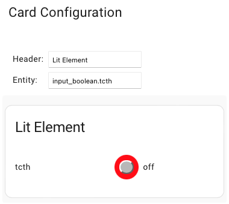

[](https://github.com/hacs/integration)

# Toggle Card With Lit


Using Lit for the toggle card

***

* @published: May 2023
* @author: Elmar Hinz
* @name: `toggle-card-lit`
* @id: `tcl`
* @lit: https://lit.dev/

You learn:

* what *Lit* is
* how to install *Lit* with *NPM*
* how it differs from vanilla javascript
* how to use it for the card editor
* how to use it for the toggle card
* how to keep the footprint small

## Goal

Lit is widely used throughout th Home Assistant frontend. You learn why it is
useful and how to use it for building cards. You also learn about some
pitfalls and how to avoid them.

## Prerequisites

* previous tutorial to build upon (tutorial 08)
* adding entities, cards and resources (tutorial 04, 02)
* setting up the core developers container (tutorial 01)
* setting up an npm based project (tutorial 08)

Find all sources inside the `src/` folder!

## About Lit

Like *HTMLElement* the *LitElement* is a parent class that you can use to build
a *HTML custom element* upon. The functionality you inherit can be compared to
frameworks like *React* or *Vue*.

The main difference is that the product is just a custom element. Different to a
framework it doesn't determine the rest of the application. On contrary it is
fully encapsulated and rather self-sufficient. Like a framework it does work
with *HTML templates* that react upon changes of the underlying model and redraw
themselves as needed.

### How does it differ to vanilla JS?

While the structure of the *vanilla JS toggle card* of the previous tutorials
was organized around the lifecycle *Lit* takes a much more declarative approach.
Less often you ask when, more often you ask where. The lifecycle isn't gone,
though. You can still make use of it. *Lit* tries to manage it for you as far as
possible.

*Lit* is speaking of *reactive properties* when it comes to the model. Updates
of the properties trigger the lifecycle. The main task of the lifecycle is to
render the *HTML template* to reflect the update.

Generally spoken the reactive properties are the configuration of the card and
the *hass object*. With such a general approach though each update of the *hass
object* would result in rerendering each and every *Lit* based card. Obviously
the solution needs to be to be more specific for not to waste the resources of
the browser. We will address this in this tutorial.

Furthermore *plain vanilla JS toggle* did create the shadow dom once and only
once. Then we applied tiny, specific changes to the *DOM*. *Lit* on the other
hand renders the whole template upon each update. While *Lit* makes some things
more simple, it isn't automatically the superior solution in terms of
performance.

### Installation

There are multiple approaches to install *Lit*. Visit its homepage to learn
more. In this tutorial we will use the toolchain of the previous tutorial
(*Node*, *Npm*) to get it running.

Open your shell inside the projects folder, for example `cd /workspaces/ha.core/config/www/tutor/09.toggle-card-lit`. Then call `npm install lit`.

Your `package.json` should now look similar to this:

```json
{
  "source": "src/index.js",
  "module": "dist/card.js",
  "targets": {
    "module": {
      "includeNodeModules": true
    }
  },
  "scripts": {
    "watch": "parcel watch",
    "build": "parcel build"
  },
  "devDependencies": {
    "@parcel/transformer-inline-string": "^2.8.3",
    "parcel": "^2.8.3"
  },
  "dependencies": {
    "lit": "^2.7.4"
  }
}
```

The *lit* library has been added to the `dependencies` section. Contrary to
`devDependencies` this entries are not used to manage the project. Instead
this libraries are bundled into the result.

## The card editor

This time we start with the card editor. We pack *HTML* and *CSS* back into the
file. They are rather small.

### Import, export and class

```js
import { css, html, LitElement } from 'lit';


export class ToggleCardLitEditor extends LitElement {
}
```

To inherit the editor class from `LitElement` we import it from `lit`.
Additionally we import `css` and `html`. The latter are an advanced JS syntax
called *tags*. Tagging a literal causes the literal to be processed by the
related functions. *Lit* uses tagged literals for the *CSS* and *HTML*
templates. See below.

### Reactive properties and states

```js
    static get properties() {
        return {
            // hass: {},
            _config: { state: true },
        };
    }

    setConfig(config) {
        this._config = config;
    }
```

The static function `static get properties()` declares the properties to
observe. *Lit* will automatically create a setter and a getter (on the level
of the prototype).

I added the `hass` object to talk about it, but I commented it out. It would
trigger the rendering process for every change of an unrelated entity. We don't
need it for the editor at all. The most simple solution is not to observe it.
*Home Assistant* doesn't complain.

On the other hand the `config` object is not shared between cards and we are
interested in all of it's updates. We can register it right away as a reactive
property. *Home Assistant* calls `setConfig(config)` not `set config(config)`,
though. Therefore we need to redirect it to the setter as `this._config =
config`. As *Home Assistant* never calls the setter directly from outside we
treat the property as internal.

*Internal reactive properties* are also addressed as *internal reactive states*.
The option `{ state: true }` tells *Lit* that `this._config` it is an internal
reactive state and not a part of the public interface of the class. The
underscore is just a convention for "private" properties.

It would work without making it explicitly internal. However, this is the
approach *Lit* suggests for reactive properties that are not part of the public
interface. Actually we don't use *public reactive properties* at all.

### CSS

```js
    static styles = css`
            .table {
                display: table;
            }
            .row {
                display: table-row;
            }
            .cell {
                display: table-cell;
                padding: 0.5em;
            }
        `;
```

The most simple and efficient way is to add the styles as a static class field
using the `css` tag. It transforms the literal into the required data type. It
could also insert variables like in the `render()` function. However, rendering
variables into CSS typically isn't the best of possible solution.

### HTML

```js
    render() {
        return html`
            <form class="table">
                <div class="row">
                    <label class="label cell" for="header">Header:</label>
                    <input
                        @change="${this.handleChangedEvent}"
                        class="value cell" id="header" value="${this._config.header}"></input>
                </div>
                <div class="row">
                    <label class="label cell" for="entity">Entity:</label>
                    <input
                        @change="${this.handleChangedEvent}"
                        class="value cell" id="entity" value="${this._config.entity}"></input>
                </div>
            </form>
        `;
    }
```

The render method is called, when the view needs to be updated. Again the
template literal is tagged (`html`). It produces the expected data type and
does process the literal.

The values of `this._config.header` and `this._config.entity` are inserted to
update the content. This are simple expressions. Many expressions are possible
inside `${...}`. [See here](https://lit.dev/docs/templates/expressions/).

The `@` expression is used to add event listeners, here the `@change`
expression.  The event handling function is connected like this
`="${this.handleChangedEvent}"`. Note that the context is automatically bound
to the event listener by this declarative approach.

Find the full documentation of Templates
[here](https://lit.dev/docs/templates/overview/).

### Event listener

```js
    handleChangedEvent(changedEvent) {
        // this._config is readonly, copy needed
        var newConfig = Object.assign({}, this._config);
        if (changedEvent.target.id == "header") {
            newConfig.header = changedEvent.target.value;
        } else if (changedEvent.target.id == "entity") {
            newConfig.entity = changedEvent.target.value;
        }
        const messageEvent = new CustomEvent("config-changed", {
            detail: { config: newConfig },
            bubbles: true,
            composed: true,
        });
        this.dispatchEvent(messageEvent);
    }
```

The event handler keeps the same as in the previous tutorials.

## The card

### Properties

As explained before we don't want to observe the *hass* object as a reactive
property. Else the card would update for each unrelated change in *hass*.
Instead we keep a reference to it as a private property. We will need it to
toggle the the state of the helper entity later on.

```js
    // private property
    _hass;

    // internal reactive states
    static get properties() {
        return {
            _header: { state: true },
            _entity: { state: true },
            _name: { state: true },
            _state: { state: true },
            _status: { state: true }
        };
    }
```

The internal reactive states are specific compared to the `hass` object. They
all are used directly within the HTML template. If one of them changes, the
rendering cycle gets triggered. `_state` holds the state object of the card.
`_status` is the status of the toggle, `on` or `off`.

## Lifecycle interface

`setConfig(conf)` and `set hass(hass)` are the lifecycle interfaces with *Home
Assistant*. Here we connect the internal reactive states.

```js
    setConfig(config) {
        this._header = config.header;
        this._entity = config.entity;
        // call set hass() to immediately adjust to a changed entity
        // while editing the entity in the card editor
        if (this._hass) {
            this.hass = this._hass
        }
    }

    set hass(hass) {
        this._hass = hass;
        this._state = hass.states[this._entity];
        if (this._state) {
            this._status = this._state.state;
            let fn = this._state.attributes.friendly_name;
            this._name = fn ? fn : this._entity;
        }
    }
```

### CSS

In this example I show how to keep a larger style sheet in a separate file
and making it importable. The CSS goes into `card.styles.js`.

```js
import { css } from 'lit';

export default css`
    .error {
        color: red;
    }
    [ ... ]
`;
```

It only imports `css` from `lit` to tag the style into the expected data
structure. The style is not dynamic otherwise. No reference the the card is
needed.

In `card.js` the style is then imported like this

```js
import styles from './card.styles';
```

and used like that.

```js
class [...] {
    [ ... ]
    static styles = styles;
    [ ... ]
}
```

### HTML

The template is triggered by the reactive properties to draw them. While it is
possible to write the logic into the literals, I prefer to keep the logic rather
outside, so the literals themselves stay simple.

You learn how the `html` literal can be composed of other `html` literals. In
this example the inner part get's stored into a variable named `content`. It
finally is inserted into an outer part.

```js
    render() {
        let content;
        if (!this._state) {
            content = html`
                <p class="error">
                    ${this._entity} is unavailable.
                </p>
            `;
        } else {
            content = html`
                <dl class="dl">
                    <dt class="dt">${this._name}</dt>
                    <dd class="dd" @click="${this.doToggle}">
                        <span class="toggle ${this._status}">
                            <span class="button"></span>
                        </span>
                        <span class="value">${this._status}</span>
                    </dd>
                </dl>
            `;
        }
        return html`
            <ha-card header="${this._header}">
                <div class="card-content">
                    ${content}
                </div>
            </ha-card>
        `;
    }
```

Depending on the availability of the `state` object, either the card is
displayed or the error message. In the previous tutorials we prepared the error
massage into the shadow DOM and hid it by *CSS*. With Lit the shadow DOM gets
re-rendered. We either render the card or the error, one at a time.

The click event listener is connected just like the change event listener in the
editor. Imperative naming helps to differ functions from properties. Mind that
the namespace is also shared with the parent classes. Compared to the previous
tutorials I don't differ lifecycle and jobs anymore for the event listeners.
With *Lit* I prefer a more declarative structure of the class.

## Event handling

```js
    // event handling

    doToggle(event) {
        this._hass.callService("input_boolean", "toggle", {
            entity_id: this._entity
        });
    }
```

## Fine tuning

There is still an issue. When we edit the entity the preview of the card does
not update automatically to display the new entity. I think that is a bug (or
missing feature) of *Home Assistant* at the moment of writing.



After calling `setConfig(config)` it does not automatically call `set
hass(hass)` to update the new entity. The workaround is to trigger it by
setting the private reference `this._hass`.

```js
    setConfig(config) {
        this._header = config.header;
        this._entity = config.entity;
        // call set hass() to immediately adjust to a changed entity
        // while editing the entity in the card editor
        if (this._hass) {
            this.hass = this._hass
        }
    }
```

